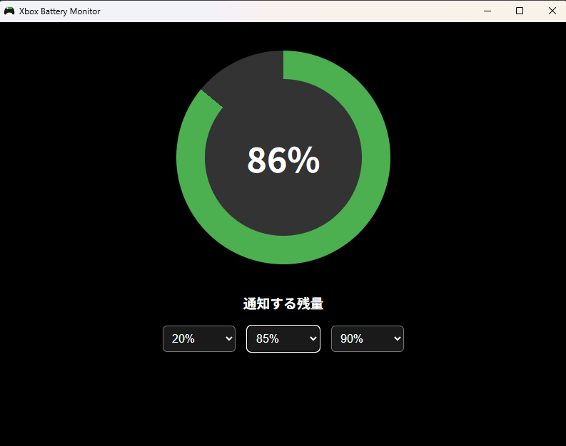
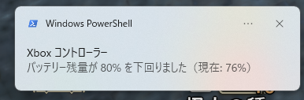

# 🎮 Xbox Battery Monitor (常駐型バッテリーチェッカー)

Windows 11環境において、Bluetooth接続されたXboxコントローラーのバッテリー残量をリアルタイムに監視し、指定した残量を下回った瞬間にデスクトップ通知を飛ばすタスクトレイ常駐型デスクトップアプリケーションです。

「ゲームに没頭していると、いつの間にかコントローラーの電池が切れて操作不能になる」という課題を解決するために開発しました。

---

## 📷 スクリーンショット

### メイン画面


### タスクトレイ常駐時（動的ツールチップ）


### 通知ポップアップ

---

## ✨ 主な機能

- **円形動的インジケーター:** コントローラーの残量をXbox風のグリーン、注意（オレンジ）、警告（赤）の3段階で直感的に可視化。未接続時は自動でグレーアウトし「未接続」状態へと切り替わります。
- **通知カスタマイズ & 設定の永続化:** 通知させたいタイミング（5%刻み）を最大3つまで自由に選択可能。設定値は `LocalStorage` へ自動保存され、次回アプリ起動時にシームレスに復元されます。
- **タスクトレイ動的ツールチップ:** ウィンドウを閉じてもバックグラウンドで常駐。トレイアイコンにマウスホバーするだけで、現在の残量や接続状態を即座に確認できます。
- **無駄な通知の重複ガード:** 10秒周期のポーリング監視を行いながらも、React側のState/Ref管理により、設定値を跨いだ「最初の1回だけ」的確に通知を発火（ゲームの邪魔をしない設計）。
- **Windows集中モード対応:** フロントエンド（React）側からTauriプラグインを介してOS標準の通知センターに直接弾着。

---

## 🛠️ 技術スタック

フロントエンド主導でありながら、OSの挙動をRustとPowerShellでハックするハイブリッドな設計を行っています。

| レイヤー           | 使用技術 / クレート              | 役割                                                                                              |
| :----------------- | :------------------------------- | :------------------------------------------------------------------------------------------------ |
| **フロントエンド** | React / TypeScript / CSS Modules | UIの描画、`LocalStorage` によるユーザー設定の永続化、OS通知の制御                                 |
| **バックエンド**   | Rust / Tauri v2                  | Windows低層プロセスの制御、非同期（Async）での5秒周期ポーリング、フロントへのイベント発火（Emit） |
| **OSインフラ**     | PowerShell / Plug and Play API   | Bluetoothデバイスの低層プロパティ直撃による正確な残量・接続状態の取得                             |

---

## 💡 こだわり・技術的な挑戦（デバッグの軌跡）

### 1. Windows 11における「接続状態とバッテリーキャッシュの呪い」の完全粉砕
従来のXInput APIや、単なるデバイスの存在チェック（`-PresentOnly`）だけでは、コントローラーの電源を落とした際にもWindows側に古いバッテリー残量や接続情報がキャッシュされ続け、UI上の表示が「接続中（過去の数値）」のままゾンビ化する問題がありました。

本アプリでは、全く同じPlug and Play APIから以下の**2つの異なる隠しプロパティキー**を組み合わせて取得することで、この問題を根本から解決しました。

1. **接続状態の厳密判定 (`{83DA6326-97A6-4088-9453-A1923F573B29} 15`)**
   まずデバイスが物理的に「今まさに電波を通しているか」を `True/False` で直撃確認。切断されていればキャッシュを問答無用で破棄します。
2. **生データの抽出 (`{104EA319-6EE2-4701-BD47-8DDBF425BBE5} 2`)**
   接続が確認された場合のみ、バッテリーデータの `Data` 属性をRustから直接狙い撃ち。

これにより、**「電源を入れた瞬間の高速検知」と「電源を切った瞬間の『未接続』へのクリーンな切り替わり」**の完全な同期に成功しました。

### 2. Rust × 非同期ループによるタスクトレイの動的更新
Rust（Tauriバックエンド）側で動かすPowerShellクエリがUIスレッドをブロッキング（詰まらせる）しないよう、`tauri::async_runtime::spawn` を用いてバックグラウンドで非同期にポーリングさせています。取得した最新ステータスは即座にフロントエンドへ `Emit` されると同時に、トレイアイコンのツールチップ（`set_tooltip`）へも動的に書き込まれる構造に仕上げました。

---

## 🚀 開発環境のセットアップ

### 前提条件
- Node.js (v18以上推奨)
- Rust / Cargo (Tauriのビルド環境)

### 実行手順

1. **リポジトリのクローン**
   ```bash
   git clone [https://github.com/R-9029/Xbox-Battery-Monitor.git](https://github.com/R-9029/Xbox-Battery-Monitor.git)
   cd Xbox-Battery-Monitor

2. **依存パッケージのインストール**
   ```bash
   npm install

3. **開発モードでの起動**
   ```bash
   npm run tauri devS